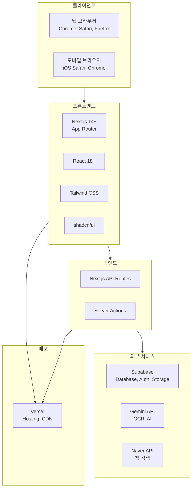
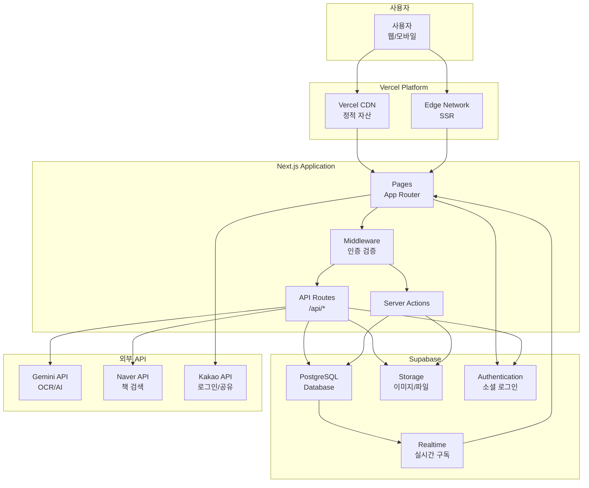
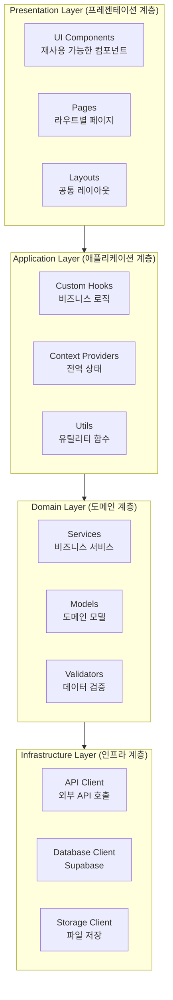
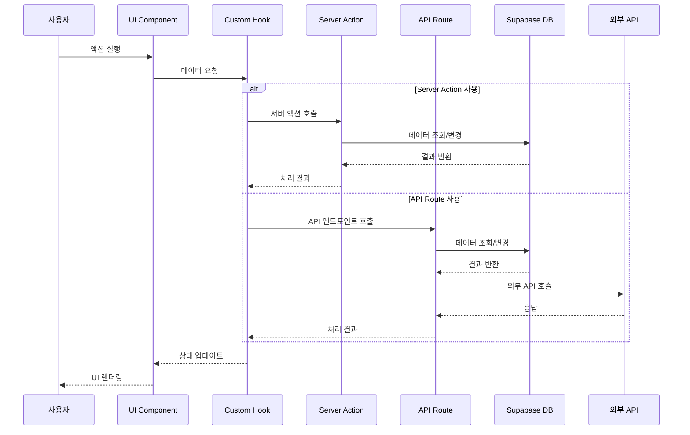
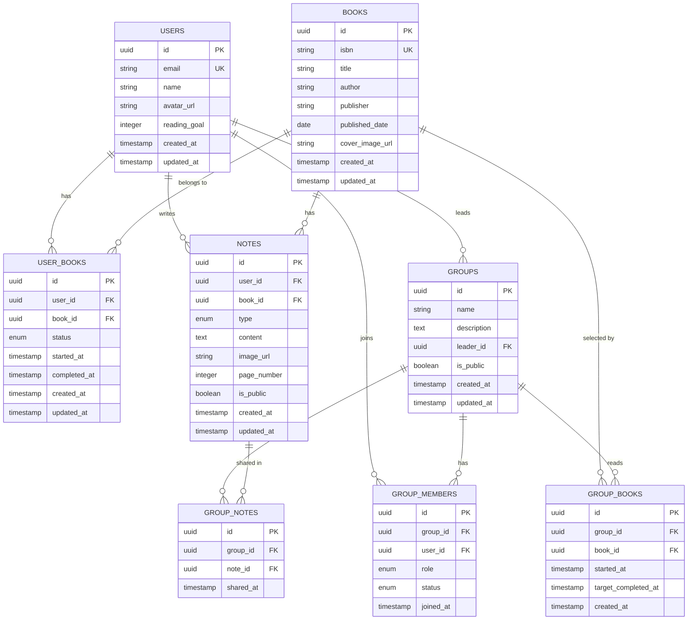
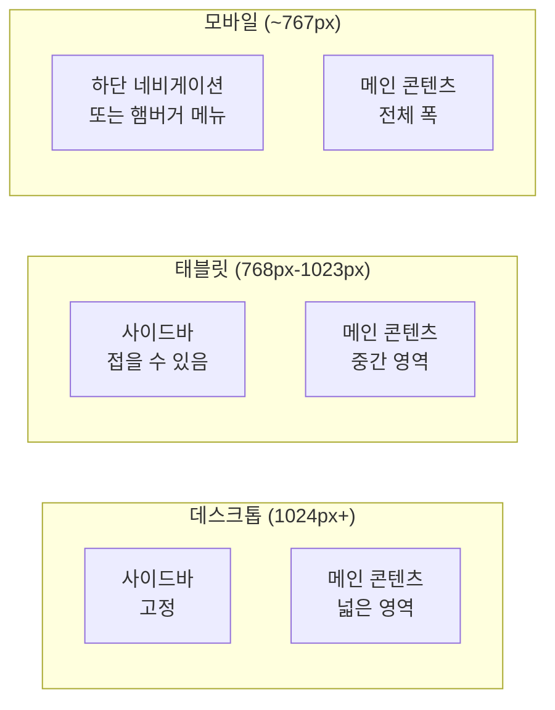
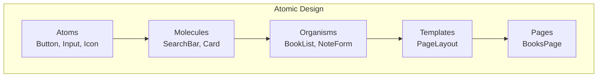
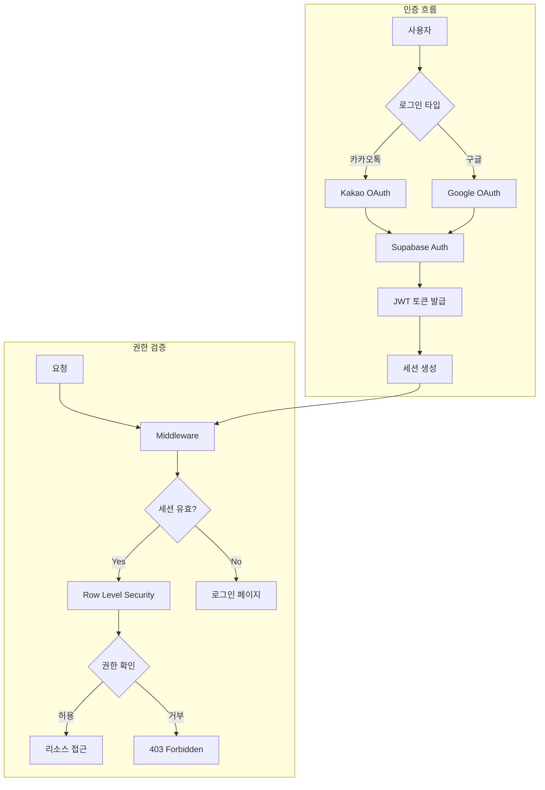
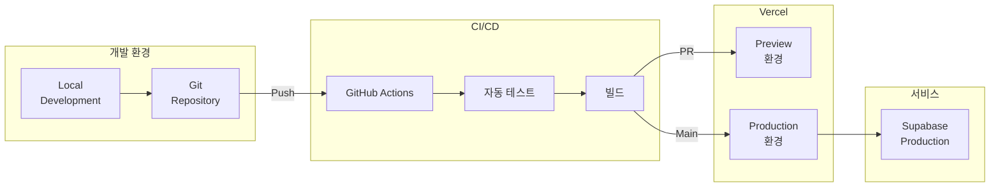
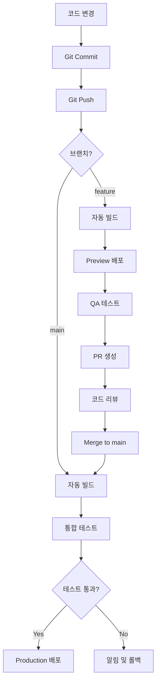

# Habitree Reading Hub - 소프트웨어 디자인 및 아키텍처 문서

**버전:** 1.0  
**작성일:** 2025년 12월  
**최종 수정일:** 2025년 12월  
**제품명:** Habitree Reading Hub  
**관련 문서:** 
- [Habitree-Reading-Hub-PRD.md](./Habitree-Reading-Hub-PRD.md)
- [user_stories.md](./user_stories.md)

---

## 목차
1. [개요](#개요)
2. [기술 스택](#기술-스택)
3. [시스템 아키텍처](#시스템-아키텍처)
4. [데이터베이스 설계](#데이터베이스-설계)
5. [프론트엔드 설계](#프론트엔드-설계)
6. [백엔드 설계](#백엔드-설계)
7. [보안 설계](#보안-설계)
8. [배포 전략](#배포-전략)

---

## 1. 개요

### 1.1 문서 목적
이 문서는 Habitree Reading Hub 서비스의 소프트웨어 디자인 및 아키텍처를 정의하고, 개발팀이 일관된 방식으로 시스템을 구축할 수 있도록 가이드를 제공합니다.

### 1.2 설계 원칙
1. **단순성 (Simplicity)**: 복잡성을 최소화하고 이해하기 쉬운 구조
2. **확장성 (Scalability)**: 사용자 증가에 대응할 수 있는 구조
3. **보안성 (Security)**: 사용자 데이터 보호를 최우선으로
4. **성능 (Performance)**: 빠른 응답 시간과 최적화된 사용자 경험
5. **유지보수성 (Maintainability)**: 코드 재사용과 모듈화

---

## 2. 기술 스택

### 2.1 전체 기술 스택 개요



### 2.2 기술 스택 상세

#### 2.2.1 프론트엔드
| 기술 | 버전 | 용도 |
|------|------|------|
| **Next.js** | 14+ | React 기반 풀스택 프레임워크, SSR/SSG |
| **React** | 18+ | UI 라이브러리 |
| **TypeScript** | 5+ | 타입 안정성 및 개발 생산성 |
| **Tailwind CSS** | 3+ | 유틸리티 기반 CSS 프레임워크 |
| **shadcn/ui** | latest | 재사용 가능한 컴포넌트 라이브러리 |
| **Lucide React** | latest | 아이콘 라이브러리 |
| **React Hook Form** | 7+ | 폼 상태 관리 |
| **Zod** | 3+ | 스키마 검증 |
| **Recharts** | 2+ | 차트 및 데이터 시각화 |
| **Swiper** | 11+ | 캐러셀 및 슬라이더 |

#### 2.2.2 백엔드
| 기술 | 버전 | 용도 |
|------|------|------|
| **Next.js API Routes** | 14+ | RESTful API 엔드포인트 |
| **Server Actions** | 14+ | 서버 사이드 데이터 변경 |
| **Supabase Client** | 2+ | Supabase 연동 |

#### 2.2.3 데이터베이스 및 스토리지
| 기술 | 버전 | 용도 |
|------|------|------|
| **Supabase PostgreSQL** | 15+ | 관계형 데이터베이스 |
| **Supabase Storage** | latest | 이미지 및 파일 저장 |
| **Supabase Auth** | latest | 인증 및 권한 관리 |

#### 2.2.4 AI 및 외부 API
| 기술 | 버전 | 용도 |
|------|------|------|
| **Gemini API** | latest | OCR, 텍스트 분석 |
| **Naver Search API** | latest | 책 검색 |
| **Kakao JavaScript SDK** | latest | 카카오톡 로그인 및 공유 |

#### 2.2.5 개발 도구
| 기술 | 버전 | 용도 |
|------|------|------|
| **ESLint** | 8+ | 코드 품질 검사 |
| **Prettier** | 3+ | 코드 포맷팅 |
| **Husky** | 8+ | Git hooks |
| **lint-staged** | 13+ | 스테이징 파일 린트 |

#### 2.2.6 배포
| 기술 | 용도 |
|------|------|
| **Vercel** | 호스팅, CDN, 자동 배포 |

---

## 3. 시스템 아키텍처

### 3.1 전체 시스템 아키텍처



### 3.2 레이어 아키텍처



### 3.3 데이터 흐름



---

## 4. 데이터베이스 설계

### 4.1 ERD (Entity Relationship Diagram)



### 4.2 테이블 스키마 정의

#### 4.2.1 Users (사용자)

```sql
-- Supabase Auth의 auth.users와 1:1 관계를 가지는 프로필 테이블
CREATE TABLE users (
    id UUID PRIMARY KEY REFERENCES auth.users(id) ON DELETE CASCADE,
    email VARCHAR(255), -- auth.users에서 자동 동기화
    name VARCHAR(100) NOT NULL,
    avatar_url TEXT,
    reading_goal INTEGER DEFAULT 12,
    created_at TIMESTAMP WITH TIME ZONE DEFAULT NOW(),
    updated_at TIMESTAMP WITH TIME ZONE DEFAULT NOW()
);

-- 인덱스
CREATE INDEX idx_users_email ON users(email);

-- RLS (Row Level Security)
ALTER TABLE users ENABLE ROW LEVEL SECURITY;

CREATE POLICY "Users can view own profile"
    ON users FOR SELECT
    USING (auth.uid() = id);

CREATE POLICY "Users can update own profile"
    ON users FOR UPDATE
    USING (auth.uid() = id);

-- 사용자 프로필 자동 생성 함수 (Supabase Auth 트리거에서 호출)
CREATE OR REPLACE FUNCTION public.handle_new_user()
RETURNS TRIGGER AS $$
BEGIN
  INSERT INTO public.users (id, email, name, avatar_url)
  VALUES (
    NEW.id,
    NEW.email,
    COALESCE(NEW.raw_user_meta_data->>'name', '사용자'),
    NEW.raw_user_meta_data->>'avatar_url'
  );
  RETURN NEW;
END;
$$ LANGUAGE plpgsql SECURITY DEFINER;

-- auth.users에 새 사용자 생성 시 자동으로 public.users에 프로필 생성
CREATE TRIGGER on_auth_user_created
  AFTER INSERT ON auth.users
  FOR EACH ROW EXECUTE FUNCTION public.handle_new_user();
```

#### 4.2.2 Books (책)

```sql
CREATE TABLE books (
    id UUID PRIMARY KEY DEFAULT uuid_generate_v4(),
    isbn VARCHAR(20), -- UNIQUE 제약조건 제거: 여러 사용자가 같은 책을 추가할 수 있도록 함
    title VARCHAR(500) NOT NULL,
    author VARCHAR(200),
    publisher VARCHAR(200),
    published_date DATE,
    cover_image_url TEXT,
    created_at TIMESTAMP WITH TIME ZONE DEFAULT NOW(),
    updated_at TIMESTAMP WITH TIME ZONE DEFAULT NOW()
);

-- ISBN이 있는 경우 중복 체크를 위한 인덱스 (UNIQUE 아님)
-- 애플리케이션 레벨에서 책 추가 시 기존 책이 있으면 재사용하는 로직 구현

-- 인덱스
CREATE INDEX idx_books_isbn ON books(isbn) WHERE isbn IS NOT NULL; -- NULL이 아닌 ISBN만 인덱싱
CREATE INDEX idx_books_title ON books(title);
CREATE INDEX idx_books_author ON books(author);

-- 전체 텍스트 검색 인덱스
CREATE INDEX idx_books_title_fts ON books USING gin(to_tsvector('simple', title));
CREATE INDEX idx_books_author_fts ON books USING gin(to_tsvector('simple', author));
```

#### 4.2.3 UserBooks (사용자-책 관계)

```sql
CREATE TYPE reading_status AS ENUM ('reading', 'completed', 'paused');

CREATE TABLE user_books (
    id UUID PRIMARY KEY DEFAULT uuid_generate_v4(),
    user_id UUID NOT NULL REFERENCES users(id) ON DELETE CASCADE,
    book_id UUID NOT NULL REFERENCES books(id) ON DELETE CASCADE,
    status reading_status DEFAULT 'reading',
    started_at TIMESTAMP WITH TIME ZONE DEFAULT NOW(),
    completed_at TIMESTAMP WITH TIME ZONE,
    created_at TIMESTAMP WITH TIME ZONE DEFAULT NOW(),
    updated_at TIMESTAMP WITH TIME ZONE DEFAULT NOW(),
    UNIQUE(user_id, book_id)
);

-- 인덱스
CREATE INDEX idx_user_books_user_id ON user_books(user_id);
CREATE INDEX idx_user_books_book_id ON user_books(book_id);
CREATE INDEX idx_user_books_status ON user_books(status);

-- RLS
ALTER TABLE user_books ENABLE ROW LEVEL SECURITY;

CREATE POLICY "Users can view own books"
    ON user_books FOR SELECT
    USING (auth.uid() = user_id);

CREATE POLICY "Users can insert own books"
    ON user_books FOR INSERT
    WITH CHECK (auth.uid() = user_id);

CREATE POLICY "Users can update own books"
    ON user_books FOR UPDATE
    USING (auth.uid() = user_id);

CREATE POLICY "Users can delete own books"
    ON user_books FOR DELETE
    USING (auth.uid() = user_id);
```

#### 4.2.4 Notes (기록)

```sql
CREATE TYPE note_type AS ENUM ('quote', 'photo', 'memo', 'transcription');

CREATE TABLE notes (
    id UUID PRIMARY KEY DEFAULT uuid_generate_v4(),
    user_id UUID NOT NULL REFERENCES users(id) ON DELETE CASCADE,
    book_id UUID NOT NULL REFERENCES books(id) ON DELETE CASCADE,
    type note_type NOT NULL,
    content TEXT,
    image_url TEXT,
    page_number INTEGER,
    is_public BOOLEAN DEFAULT FALSE,
    tags TEXT[],
    created_at TIMESTAMP WITH TIME ZONE DEFAULT NOW(),
    updated_at TIMESTAMP WITH TIME ZONE DEFAULT NOW()
);

-- 인덱스
CREATE INDEX idx_notes_user_id ON notes(user_id);
CREATE INDEX idx_notes_book_id ON notes(book_id);
CREATE INDEX idx_notes_type ON notes(type);
CREATE INDEX idx_notes_created_at ON notes(created_at DESC);
CREATE INDEX idx_notes_page_number ON notes(page_number);

-- 전체 텍스트 검색 인덱스
CREATE INDEX idx_notes_content_fts ON notes USING gin(to_tsvector('simple', content));

-- 태그 인덱스
CREATE INDEX idx_notes_tags ON notes USING gin(tags);

-- RLS
ALTER TABLE notes ENABLE ROW LEVEL SECURITY;

CREATE POLICY "Users can view own notes"
    ON notes FOR SELECT
    USING (auth.uid() = user_id OR is_public = TRUE);

CREATE POLICY "Users can insert own notes"
    ON notes FOR INSERT
    WITH CHECK (auth.uid() = user_id);

CREATE POLICY "Users can update own notes"
    ON notes FOR UPDATE
    USING (auth.uid() = user_id);

CREATE POLICY "Users can delete own notes"
    ON notes FOR DELETE
    USING (auth.uid() = user_id);
```

#### 4.2.5 Groups (독서모임)

```sql
CREATE TABLE groups (
    id UUID PRIMARY KEY DEFAULT uuid_generate_v4(),
    name VARCHAR(200) NOT NULL,
    description TEXT,
    leader_id UUID NOT NULL REFERENCES users(id) ON DELETE CASCADE,
    is_public BOOLEAN DEFAULT FALSE,
    created_at TIMESTAMP WITH TIME ZONE DEFAULT NOW(),
    updated_at TIMESTAMP WITH TIME ZONE DEFAULT NOW()
);

-- 인덱스
CREATE INDEX idx_groups_leader_id ON groups(leader_id);
CREATE INDEX idx_groups_is_public ON groups(is_public);

-- RLS
ALTER TABLE groups ENABLE ROW LEVEL SECURITY;

CREATE POLICY "Anyone can view public groups"
    ON groups FOR SELECT
    USING (is_public = TRUE OR auth.uid() IN (
        SELECT user_id FROM group_members WHERE group_id = groups.id
    ));

CREATE POLICY "Authenticated users can create groups"
    ON groups FOR INSERT
    WITH CHECK (auth.uid() = leader_id);

CREATE POLICY "Leaders can update groups"
    ON groups FOR UPDATE
    USING (auth.uid() = leader_id);

CREATE POLICY "Leaders can delete groups"
    ON groups FOR DELETE
    USING (auth.uid() = leader_id);
```

#### 4.2.6 GroupMembers (모임 멤버)

```sql
CREATE TYPE member_role AS ENUM ('leader', 'member');
CREATE TYPE member_status AS ENUM ('pending', 'approved', 'rejected');

CREATE TABLE group_members (
    id UUID PRIMARY KEY DEFAULT uuid_generate_v4(),
    group_id UUID NOT NULL REFERENCES groups(id) ON DELETE CASCADE,
    user_id UUID NOT NULL REFERENCES users(id) ON DELETE CASCADE,
    role member_role DEFAULT 'member',
    status member_status DEFAULT 'pending',
    joined_at TIMESTAMP WITH TIME ZONE DEFAULT NOW(),
    UNIQUE(group_id, user_id)
);

-- 인덱스
CREATE INDEX idx_group_members_group_id ON group_members(group_id);
CREATE INDEX idx_group_members_user_id ON group_members(user_id);
CREATE INDEX idx_group_members_status ON group_members(status);

-- RLS
ALTER TABLE group_members ENABLE ROW LEVEL SECURITY;

CREATE POLICY "Members can view group members"
    ON group_members FOR SELECT
    USING (auth.uid() IN (
        SELECT user_id FROM group_members WHERE group_id = group_members.group_id
    ));

CREATE POLICY "Users can request to join"
    ON group_members FOR INSERT
    WITH CHECK (auth.uid() = user_id);

CREATE POLICY "Leaders can manage members"
    ON group_members FOR UPDATE
    USING (auth.uid() IN (
        SELECT leader_id FROM groups WHERE id = group_members.group_id
    ));
```

#### 4.2.7 GroupBooks (모임 책)

```sql
CREATE TABLE group_books (
    id UUID PRIMARY KEY DEFAULT uuid_generate_v4(),
    group_id UUID NOT NULL REFERENCES groups(id) ON DELETE CASCADE,
    book_id UUID NOT NULL REFERENCES books(id) ON DELETE CASCADE,
    started_at TIMESTAMP WITH TIME ZONE DEFAULT NOW(),
    target_completed_at TIMESTAMP WITH TIME ZONE,
    created_at TIMESTAMP WITH TIME ZONE DEFAULT NOW(),
    UNIQUE(group_id, book_id)
);

-- 인덱스
CREATE INDEX idx_group_books_group_id ON group_books(group_id);
CREATE INDEX idx_group_books_book_id ON group_books(book_id);

-- RLS
ALTER TABLE group_books ENABLE ROW LEVEL SECURITY;

CREATE POLICY "Members can view group books"
    ON group_books FOR SELECT
    USING (auth.uid() IN (
        SELECT user_id FROM group_members WHERE group_id = group_books.group_id
    ));

CREATE POLICY "Leaders can add group books"
    ON group_books FOR INSERT
    WITH CHECK (auth.uid() IN (
        SELECT leader_id FROM groups WHERE id = group_books.group_id
    ));
```

#### 4.2.8 GroupNotes (모임 내 공유 기록)

```sql
CREATE TABLE group_notes (
    id UUID PRIMARY KEY DEFAULT uuid_generate_v4(),
    group_id UUID NOT NULL REFERENCES groups(id) ON DELETE CASCADE,
    note_id UUID NOT NULL REFERENCES notes(id) ON DELETE CASCADE,
    shared_at TIMESTAMP WITH TIME ZONE DEFAULT NOW(),
    UNIQUE(group_id, note_id)
);

-- 인덱스
CREATE INDEX idx_group_notes_group_id ON group_notes(group_id);
CREATE INDEX idx_group_notes_note_id ON group_notes(note_id);

-- RLS
ALTER TABLE group_notes ENABLE ROW LEVEL SECURITY;

CREATE POLICY "Members can view shared notes"
    ON group_notes FOR SELECT
    USING (auth.uid() IN (
        SELECT user_id FROM group_members WHERE group_id = group_notes.group_id
    ));

CREATE POLICY "Note owners can share to groups"
    ON group_notes FOR INSERT
    WITH CHECK (auth.uid() IN (
        SELECT user_id FROM notes WHERE id = group_notes.note_id
    ));
```

### 4.3 데이터베이스 함수 및 트리거

#### 4.3.1 Updated_at 자동 업데이트

```sql
CREATE OR REPLACE FUNCTION update_updated_at_column()
RETURNS TRIGGER AS $$
BEGIN
    NEW.updated_at = NOW();
    RETURN NEW;
END;
$$ LANGUAGE plpgsql;

-- 각 테이블에 트리거 적용
CREATE TRIGGER update_users_updated_at
    BEFORE UPDATE ON users
    FOR EACH ROW
    EXECUTE FUNCTION update_updated_at_column();

CREATE TRIGGER update_books_updated_at
    BEFORE UPDATE ON books
    FOR EACH ROW
    EXECUTE FUNCTION update_updated_at_column();

CREATE TRIGGER update_user_books_updated_at
    BEFORE UPDATE ON user_books
    FOR EACH ROW
    EXECUTE FUNCTION update_updated_at_column();

CREATE TRIGGER update_notes_updated_at
    BEFORE UPDATE ON notes
    FOR EACH ROW
    EXECUTE FUNCTION update_updated_at_column();

CREATE TRIGGER update_groups_updated_at
    BEFORE UPDATE ON groups
    FOR EACH ROW
    EXECUTE FUNCTION update_updated_at_column();
```

#### 4.3.2 독서 통계 함수

```sql
-- 사용자의 올해 완독 책 수 조회
CREATE OR REPLACE FUNCTION get_user_completed_books_count(
    p_user_id UUID,
    p_year INTEGER DEFAULT EXTRACT(YEAR FROM CURRENT_DATE)::INTEGER
)
RETURNS INTEGER AS $$
BEGIN
    RETURN (
        SELECT COUNT(*)
        FROM user_books
        WHERE user_id = p_user_id
            AND status = 'completed'
            AND EXTRACT(YEAR FROM completed_at) = p_year
    );
END;
$$ LANGUAGE plpgsql;

-- 사용자의 이번 주 작성한 기록 수
CREATE OR REPLACE FUNCTION get_user_notes_count_this_week(
    p_user_id UUID
)
RETURNS INTEGER AS $$
BEGIN
    RETURN (
        SELECT COUNT(*)
        FROM notes
        WHERE user_id = p_user_id
            AND created_at >= DATE_TRUNC('week', CURRENT_DATE)
    );
END;
$$ LANGUAGE plpgsql;
```

---

## 5. 프론트엔드 설계

### 5.1 폴더 구조

```
front/
├── app/                          # Next.js App Router
│   ├── (auth)/                   # 인증 관련 페이지 그룹
│   │   ├── login/
│   │   ├── signup/
│   │   └── callback/
│   ├── (main)/                   # 메인 앱 페이지 그룹
│   │   ├── layout.tsx            # 사이드바 포함 레이아웃
│   │   ├── page.tsx              # 홈/대시보드
│   │   ├── books/
│   │   │   ├── page.tsx          # 내 서재
│   │   │   ├── [id]/
│   │   │   │   └── page.tsx      # 책 상세
│   │   │   └── search/
│   │   │       └── page.tsx      # 책 검색
│   │   ├── notes/
│   │   │   ├── page.tsx          # 기록 목록
│   │   │   ├── new/
│   │   │   │   └── page.tsx      # 기록 작성
│   │   │   └── [id]/
│   │   │       ├── page.tsx      # 기록 상세
│   │   │       └── edit/
│   │   │           └── page.tsx  # 기록 수정
│   │   ├── search/
│   │   │   └── page.tsx          # 검색
│   │   ├── timeline/
│   │   │   └── page.tsx          # 타임라인
│   │   ├── groups/
│   │   │   ├── page.tsx          # 모임 목록
│   │   │   ├── new/
│   │   │   │   └── page.tsx      # 모임 생성
│   │   │   └── [id]/
│   │   │       └── page.tsx      # 모임 대시보드
│   │   └── profile/
│   │       └── page.tsx          # 프로필
│   ├── api/                      # API Routes
│   │   ├── books/
│   │   │   └── search/
│   │   │       └── route.ts      # 책 검색 API
│   │   ├── ocr/
│   │   │   └── route.ts          # OCR 처리 API
│   │   ├── share/
│   │   │   └── card/
│   │   │       └── route.ts      # 카드뉴스 생성 API
│   │   └── upload/
│   │       └── route.ts          # 파일 업로드 API
│   ├── share/                    # 공유 페이지
│   │   └── notes/
│   │       └── [id]/
│   │           └── page.tsx      # 공유된 기록 조회
│   ├── layout.tsx                # 루트 레이아웃
│   ├── globals.css               # 전역 스타일
│   └── error.tsx                 # 에러 페이지
├── components/                   # 컴포넌트
│   ├── layout/                   # 레이아웃 컴포넌트
│   │   ├── header.tsx
│   │   ├── sidebar.tsx
│   │   ├── mobile-nav.tsx
│   │   └── footer.tsx
│   ├── auth/                     # 인증 컴포넌트
│   │   ├── login-form.tsx
│   │   └── social-login-buttons.tsx
│   ├── books/                    # 책 관련 컴포넌트
│   │   ├── book-card.tsx
│   │   ├── book-list.tsx
│   │   ├── book-search.tsx
│   │   └── book-status-badge.tsx
│   ├── notes/                    # 기록 관련 컴포넌트
│   │   ├── note-card.tsx
│   │   ├── note-form.tsx
│   │   ├── note-list.tsx
│   │   └── note-type-tabs.tsx
│   ├── groups/                   # 모임 관련 컴포넌트
│   │   ├── group-card.tsx
│   │   ├── group-dashboard.tsx
│   │   └── member-list.tsx
│   ├── timeline/                 # 타임라인 컴포넌트
│   │   └── timeline-item.tsx
│   ├── share/                    # 공유 컴포넌트
│   │   ├── card-news-generator.tsx
│   │   └── share-buttons.tsx
│   └── ui/                       # shadcn/ui 컴포넌트
│       ├── button.tsx
│       ├── card.tsx
│       ├── dialog.tsx
│       ├── input.tsx
│       └── ...
├── lib/                          # 라이브러리 및 유틸리티
│   ├── supabase/                 # Supabase 관련
│   │   ├── client.ts             # 클라이언트 사이드
│   │   ├── server.ts             # 서버 사이드
│   │   └── middleware.ts         # 미들웨어
│   ├── api/                      # API 클라이언트
│   │   ├── books.ts
│   │   ├── notes.ts
│   │   ├── groups.ts
│   │   └── naver.ts
│   ├── utils/                    # 유틸리티 함수
│   │   ├── cn.ts                 # className 헬퍼
│   │   ├── date.ts               # 날짜 포맷
│   │   └── image.ts              # 이미지 처리
│   └── validations/              # Zod 스키마
│       ├── book.ts
│       ├── note.ts
│       └── group.ts
├── hooks/                        # Custom Hooks
│   ├── use-auth.ts
│   ├── use-books.ts
│   ├── use-notes.ts
│   ├── use-groups.ts
│   └── use-search.ts
├── types/                        # TypeScript 타입 정의
│   ├── database.ts               # Supabase 타입
│   ├── book.ts
│   ├── note.ts
│   └── group.ts
├── contexts/                     # React Context
│   └── auth-context.tsx
└── public/                       # 정적 자산
    ├── images/
    └── fonts/
```

### 5.2 UI/UX 설계

#### 5.2.1 반응형 레이아웃



#### 5.2.2 사이드바 구조

```typescript
// components/layout/sidebar.tsx 개념 설계
interface SidebarItem {
  icon: LucideIcon;
  label: string;
  href: string;
  badge?: number; // 알림 배지
}

const sidebarItems: SidebarItem[] = [
  { icon: Home, label: '홈', href: '/' },
  { icon: Library, label: '내 서재', href: '/books' },
  { icon: PenTool, label: '기록 작성', href: '/notes/new' },
  { icon: Search, label: '검색', href: '/search' },
  { icon: Clock, label: '타임라인', href: '/timeline' },
  { icon: Users, label: '독서모임', href: '/groups' },
  { icon: User, label: '프로필', href: '/profile' },
];
```

#### 5.2.3 컴포넌트 설계 원칙



### 5.3 주요 페이지 와이어프레임

#### 5.3.1 홈/대시보드

```
┌─────────────────────────────────────────────────────────────┐
│  [Logo]  Habitree Reading Hub              [Profile] [Bell] │
├────────┬────────────────────────────────────────────────────┤
│        │  올해 독서 목표                                      │
│ [홈]   │  ████████░░░░░░░░ 12/24권 (50%)                    │
│ [서재] │                                                      │
│ [기록] │  이번 주 통계                                        │
│ [검색] │  ┌──────────┬──────────┬──────────┐                │
│ [타임] │  │ 읽은 책  │ 작성기록 │ 공유횟수 │                │
│ [모임] │  │   3권    │   8개    │   2회    │                │
│ [프로] │  └──────────┴──────────┴──────────┘                │
│        │                                                      │
│        │  최근 기록                                           │
│        │  ┌─────────────────────────────────┐               │
│        │  │ [표지] 책제목                    │               │
│        │  │ "인상 깊은 문장..."             │               │
│        │  │ 2시간 전                         │               │
│        │  └─────────────────────────────────┘               │
│        │  ┌─────────────────────────────────┐               │
│        │  │ [표지] 책제목                    │               │
│        │  │ "또 다른 문장..."               │               │
│        │  │ 5시간 전                         │               │
│        │  └─────────────────────────────────┘               │
└────────┴────────────────────────────────────────────────────┘
```

#### 5.3.2 내 서재

```
┌─────────────────────────────────────────────────────────────┐
│  내 서재                        [+ 책 추가] [정렬 ▼]         │
├────────┬────────────────────────────────────────────────────┤
│        │  [읽는 중] [완독] [중단]                            │
│ 사이드 │                                                      │
│ 바     │  ┌───────┐ ┌───────┐ ┌───────┐ ┌───────┐         │
│        │  │ 표지  │ │ 표지  │ │ 표지  │ │ 표지  │         │
│        │  │       │ │       │ │       │ │       │         │
│        │  │       │ │       │ │       │ │       │         │
│        │  └───────┘ └───────┘ └───────┘ └───────┘         │
│        │  책제목     책제목     책제목     책제목            │
│        │  저자       저자       저자       저자              │
│        │                                                      │
│        │  ┌───────┐ ┌───────┐ ┌───────┐ ┌───────┐         │
│        │  │ 표지  │ │ 표지  │ │ 표지  │ │ 표지  │         │
│        │  │       │ │       │ │       │ │       │         │
│        │  │       │ │       │ │       │ │       │         │
│        │  └───────┘ └───────┘ └───────┘ └───────┘         │
│        │  책제목     책제목     책제목     책제목            │
└────────┴────────────────────────────────────────────────────┘
```

#### 5.3.3 기록 작성

```
┌─────────────────────────────────────────────────────────────┐
│  기록 작성                                    [저장] [취소]  │
├────────┬────────────────────────────────────────────────────┤
│        │  [필사] [사진] [메모]                               │
│ 사이드 │                                                      │
│ 바     │  ┌────────────────────────────────────────┐         │
│        │  │ 텍스트 입력 영역                        │         │
│        │  │                                         │         │
│        │  │                                         │         │
│        │  │                                         │         │
│        │  │                                         │         │
│        │  │                                         │         │
│        │  └────────────────────────────────────────┘         │
│        │  0 / 5,000자                                        │
│        │                                                      │
│        │  페이지 번호: [___]                                 │
│        │                                                      │
│        │  [📷 이미지 업로드] (선택사항)                      │
│        │                                                      │
│        │  공개 설정: [○ 비공개] [○ 공개]                    │
│        │                                                      │
└────────┴────────────────────────────────────────────────────┘
```

### 5.4 상태 관리

```typescript
// hooks/use-notes.ts 예시
interface UseNotesReturn {
  notes: Note[];
  isLoading: boolean;
  error: Error | null;
  createNote: (data: CreateNoteInput) => Promise<Note>;
  updateNote: (id: string, data: UpdateNoteInput) => Promise<Note>;
  deleteNote: (id: string) => Promise<void>;
  refetch: () => Promise<void>;
}

export function useNotes(bookId?: string): UseNotesReturn {
  const [notes, setNotes] = useState<Note[]>([]);
  const [isLoading, setIsLoading] = useState(true);
  const [error, setError] = useState<Error | null>(null);

  // ... 구현
}
```

### 5.5 반응형 디자인 브레이크포인트

```typescript
// tailwind.config.ts
export default {
  theme: {
    screens: {
      'sm': '640px',   // 모바일 (세로)
      'md': '768px',   // 태블릿 (세로)
      'lg': '1024px',  // 태블릿 (가로) / 작은 데스크톱
      'xl': '1280px',  // 데스크톱
      '2xl': '1536px', // 큰 데스크톱
    },
  },
};
```

---

## 6. 백엔드 설계

### 6.1 API 엔드포인트 설계

#### 6.1.1 API 라우트 구조

```
/api/
├── books/
│   ├── search              GET    책 검색 (네이버 API)
│   └── [id]                GET    책 상세 정보
├── notes/
│   ├── /                   GET    기록 목록 조회
│   ├── /                   POST   기록 생성
│   ├── [id]                GET    기록 상세 조회
│   ├── [id]                PATCH  기록 수정
│   └── [id]                DELETE 기록 삭제
├── search/
│   └── /                   GET    전체 검색
├── ocr/
│   ├── /                   POST   OCR 처리 요청 (즉시 응답, Queue에 추가)
│   └── process             POST   OCR 실제 처리 (Queue에서 호출)
├── share/
│   └── card/               POST   카드뉴스 생성
├── upload/
│   └── /                   POST   파일 업로드
└── groups/
    ├── /                   GET    모임 목록
    ├── /                   POST   모임 생성
    ├── [id]                GET    모임 상세
    ├── [id]/members        GET    모임 멤버
    └── [id]/join           POST   모임 참여 신청
```

#### 6.1.2 Server Actions

```typescript
// app/actions/notes.ts
'use server';

import { createServerClient } from '@/lib/supabase/server';
import { revalidatePath } from 'next/cache';

export async function createNote(data: CreateNoteInput) {
  const supabase = createServerClient();
  
  // 인증 확인
  const { data: { user }, error: authError } = await supabase.auth.getUser();
  if (authError || !user) {
    throw new Error('Unauthorized');
  }

  // 데이터 검증
  const validated = createNoteSchema.parse(data);

  // 노트 생성
  const { data: note, error } = await supabase
    .from('notes')
    .insert({
      user_id: user.id,
      book_id: validated.bookId,
      type: validated.type,
      content: validated.content,
      page_number: validated.pageNumber,
    })
    .select()
    .single();

  if (error) throw error;

  // 캐시 재검증
  revalidatePath(`/books/${validated.bookId}`);
  revalidatePath('/timeline');

  return note;
}
```

### 6.2 외부 API 연동

#### 6.2.1 네이버 검색 API

```typescript
// lib/api/naver.ts
import { cache } from 'react';

interface NaverBookSearchParams {
  query: string;
  display?: number;
  start?: number;
}

export const searchBooks = cache(async (params: NaverBookSearchParams) => {
  const { query, display = 10, start = 1 } = params;

  const url = new URL('https://openapi.naver.com/v1/search/book.json');
  url.searchParams.append('query', query);
  url.searchParams.append('display', display.toString());
  url.searchParams.append('start', start.toString());

  const response = await fetch(url, {
    headers: {
      'X-Naver-Client-Id': process.env.NAVER_CLIENT_ID!,
      'X-Naver-Client-Secret': process.env.NAVER_CLIENT_SECRET!,
    },
    next: { revalidate: 3600 }, // 1시간 캐시
  });

  if (!response.ok) {
    throw new Error('Failed to fetch books from Naver API');
  }

  return response.json();
});
```

#### 6.2.2 Gemini API (OCR) - 비동기 처리

```typescript
// lib/api/gemini.ts
import { GoogleGenerativeAI } from '@google/generative-ai';

const genAI = new GoogleGenerativeAI(process.env.GEMINI_API_KEY!);

// OCR 처리 함수 (비동기 Queue에서 호출)
export async function extractTextFromImage(imageUrl: string): Promise<string> {
  const model = genAI.getGenerativeModel({ model: 'gemini-1.5-flash' });

  // 이미지 다운로드
  const response = await fetch(imageUrl);
  const buffer = await response.arrayBuffer();
  const base64Image = Buffer.from(buffer).toString('base64');

  // OCR 요청
  const prompt = `
    이 이미지에서 텍스트를 추출해주세요. 
    한글과 영어를 모두 정확하게 인식하고, 
    줄바꿈과 문단을 유지해주세요.
    텍스트만 반환하고 다른 설명은 포함하지 마세요.
  `;

  const result = await model.generateContent([
    prompt,
    {
      inlineData: {
        data: base64Image,
        mimeType: 'image/jpeg',
      },
    },
  ]);

  const text = result.response.text();
  return text.trim();
}

// OCR Queue 작업 처리 (Vercel Queue 또는 Supabase Edge Functions)
// app/api/ocr/process/route.ts
import { extractTextFromImage } from '@/lib/api/gemini';
import { createServerClient } from '@/lib/supabase/server';

export async function POST(request: Request) {
  const { noteId, imageUrl } = await request.json();
  const supabase = createServerClient();

  try {
    // OCR 처리 (비동기)
    const extractedText = await extractTextFromImage(imageUrl);

    // Notes 테이블 업데이트
    const { error } = await supabase
      .from('notes')
      .update({ content: extractedText })
      .eq('id', noteId);

    if (error) throw error;

    return Response.json({ success: true });
  } catch (error) {
    console.error('OCR processing error:', error);
    // 실패 시 재시도 로직 (Queue에서 자동 처리)
    throw error;
  }
}
```

### 6.3 파일 업로드 처리

```typescript
// app/api/upload/route.ts
import { NextRequest, NextResponse } from 'next/server';
import { createServerClient } from '@/lib/supabase/server';
import sharp from 'sharp';

export async function POST(request: NextRequest) {
  try {
    const supabase = createServerClient();

    // 인증 확인
    const { data: { user }, error: authError } = await supabase.auth.getUser();
    if (authError || !user) {
      return NextResponse.json({ error: 'Unauthorized' }, { status: 401 });
    }

    // 폼 데이터 파싱
    const formData = await request.formData();
    const file = formData.get('file') as File;
    const type = formData.get('type') as string; // 'photo' | 'transcription'

    if (!file) {
      return NextResponse.json({ error: 'No file provided' }, { status: 400 });
    }

    // 파일 크기 확인 (최대 5MB)
    const MAX_SIZE = 5 * 1024 * 1024;
    if (file.size > MAX_SIZE) {
      // 이미지 압축
      const buffer = await file.arrayBuffer();
      const compressed = await sharp(Buffer.from(buffer))
        .resize(1920, 1920, { fit: 'inside', withoutEnlargement: true })
        .jpeg({ quality: 80 })
        .toBuffer();

      const compressedFile = new File([compressed], file.name, { type: 'image/jpeg' });
      
      // 업로드 처리
      return uploadToStorage(supabase, user.id, compressedFile, type);
    }

    return uploadToStorage(supabase, user.id, file, type);
  } catch (error) {
    console.error('Upload error:', error);
    return NextResponse.json({ error: 'Upload failed' }, { status: 500 });
  }
}

async function uploadToStorage(
  supabase: any,
  userId: string,
  file: File,
  type: string
) {
  const fileExt = file.name.split('.').pop();
  const fileName = `${Date.now()}.${fileExt}`;
  const filePath = `${type}s/${userId}/${fileName}`;

  const { data, error } = await supabase.storage
    .from('images')
    .upload(filePath, file, {
      cacheControl: '3600',
      upsert: false,
    });

  if (error) {
    throw error;
  }

  // 공개 URL 생성
  const { data: { publicUrl } } = supabase.storage
    .from('images')
    .getPublicUrl(filePath);

  return NextResponse.json({ url: publicUrl });
}
```

### 6.4 미들웨어 설계

```typescript
// middleware.ts
import { NextResponse } from 'next/server';
import type { NextRequest } from 'next/server';
import { createMiddlewareClient } from '@supabase/auth-helpers-nextjs';

export async function middleware(req: NextRequest) {
  const res = NextResponse.next();
  const supabase = createMiddlewareClient({ req, res });

  // 세션 새로고침
  const {
    data: { session },
  } = await supabase.auth.getSession();

  // 보호된 라우트 확인
  const protectedPaths = ['/books', '/notes', '/timeline', '/groups', '/profile'];
  const isProtectedPath = protectedPaths.some(path => 
    req.nextUrl.pathname.startsWith(path)
  );

  // 인증되지 않은 사용자는 로그인 페이지로 리다이렉트
  if (isProtectedPath && !session) {
    const redirectUrl = req.nextUrl.clone();
    redirectUrl.pathname = '/login';
    redirectUrl.searchParams.set('redirectedFrom', req.nextUrl.pathname);
    return NextResponse.redirect(redirectUrl);
  }

  // 이미 로그인한 사용자가 로그인 페이지 접근 시 홈으로 리다이렉트
  if (req.nextUrl.pathname === '/login' && session) {
    return NextResponse.redirect(new URL('/', req.url));
  }

  return res;
}

export const config = {
  matcher: [
    '/((?!_next/static|_next/image|favicon.ico|.*\\.(?:svg|png|jpg|jpeg|gif|webp)$).*)',
  ],
};
```

---

## 7. 보안 설계

### 7.1 인증 및 권한 관리



### 7.2 Row Level Security (RLS) 정책

각 테이블별 RLS 정책은 데이터베이스 설계 섹션에 정의되어 있습니다. 주요 원칙:

1. **기본 비공개**: 모든 데이터는 기본적으로 본인만 접근 가능
2. **선택적 공개**: `is_public` 플래그로 공개 범위 제어
3. **그룹 공유**: 모임 멤버 간 데이터 공유 정책
4. **리더 권한**: 모임 리더는 모임 설정 및 멤버 관리 가능

### 7.3 데이터 암호화

```typescript
// lib/encryption.ts
import { createCipheriv, createDecipheriv, randomBytes } from 'crypto';

const ALGORITHM = 'aes-256-gcm';
const KEY = Buffer.from(process.env.ENCRYPTION_KEY!, 'hex'); // 32 bytes

export function encrypt(text: string): string {
  const iv = randomBytes(16);
  const cipher = createCipheriv(ALGORITHM, KEY, iv);
  
  let encrypted = cipher.update(text, 'utf8', 'hex');
  encrypted += cipher.final('hex');
  
  const authTag = cipher.getAuthTag();
  
  return `${iv.toString('hex')}:${authTag.toString('hex')}:${encrypted}`;
}

export function decrypt(encryptedText: string): string {
  const [ivHex, authTagHex, encrypted] = encryptedText.split(':');
  
  const iv = Buffer.from(ivHex, 'hex');
  const authTag = Buffer.from(authTagHex, 'hex');
  const decipher = createDecipheriv(ALGORITHM, KEY, iv);
  
  decipher.setAuthTag(authTag);
  
  let decrypted = decipher.update(encrypted, 'hex', 'utf8');
  decrypted += decipher.final('utf8');
  
  return decrypted;
}
```

### 7.4 입력 검증 및 Sanitization

```typescript
// lib/validations/note.ts
import { z } from 'zod';

export const createNoteSchema = z.object({
  bookId: z.string().uuid('유효한 책 ID를 입력해주세요'),
  type: z.enum(['quote', 'photo', 'memo', 'transcription']),
  content: z
    .string()
    .max(10000, '내용은 최대 10,000자까지 입력 가능합니다')
    .optional(),
  imageUrl: z.string().url('유효한 URL을 입력해주세요').optional(),
  pageNumber: z
    .number()
    .int('페이지 번호는 정수여야 합니다')
    .positive('페이지 번호는 양수여야 합니다')
    .optional(),
  isPublic: z.boolean().default(false),
  tags: z.array(z.string()).max(10, '태그는 최대 10개까지 추가 가능합니다').optional(),
});

export type CreateNoteInput = z.infer<typeof createNoteSchema>;
```

### 7.5 Rate Limiting

```typescript
// lib/rate-limit.ts
import { LRUCache } from 'lru-cache';

type RateLimitOptions = {
  interval: number; // 시간 간격 (ms)
  uniqueTokenPerInterval: number; // 간격당 최대 토큰 수
};

export function rateLimit(options: RateLimitOptions) {
  const tokenCache = new LRUCache({
    max: options.uniqueTokenPerInterval || 500,
    ttl: options.interval || 60000,
  });

  return {
    check: (limit: number, token: string) =>
      new Promise<void>((resolve, reject) => {
        const tokenCount = (tokenCache.get(token) as number[]) || [0];
        if (tokenCount[0] === 0) {
          tokenCache.set(token, [1]);
          resolve();
        } else if (tokenCount[0] < limit) {
          tokenCount[0] += 1;
          tokenCache.set(token, tokenCount);
          resolve();
        } else {
          reject(new Error('Rate limit exceeded'));
        }
      }),
  };
}

// 사용 예시
const limiter = rateLimit({
  interval: 60 * 1000, // 1분
  uniqueTokenPerInterval: 500,
});

// API Route에서
export async function POST(request: NextRequest) {
  const ip = request.ip ?? '127.0.0.1';
  
  try {
    await limiter.check(10, ip); // 1분에 10회 제한
  } catch {
    return NextResponse.json({ error: 'Rate limit exceeded' }, { status: 429 });
  }
  
  // ... 나머지 로직
}
```

---

## 8. 배포 전략

### 8.1 배포 아키텍처



### 8.2 환경 변수 설정

```bash
# .env.local (개발 환경)
# .env.production (프로덕션 - Vercel에서 설정)

# Next.js
NEXT_PUBLIC_APP_URL=http://localhost:3000

# Supabase
NEXT_PUBLIC_SUPABASE_URL=https://xxx.supabase.co
NEXT_PUBLIC_SUPABASE_ANON_KEY=xxx
SUPABASE_SERVICE_ROLE_KEY=xxx

# Naver API
NAVER_CLIENT_ID=xxx
NAVER_CLIENT_SECRET=xxx

# Gemini API
GEMINI_API_KEY=xxx

# Kakao
NEXT_PUBLIC_KAKAO_APP_KEY=xxx

# Encryption (프로덕션만)
ENCRYPTION_KEY=xxx
```

### 8.3 배포 프로세스



### 8.4 모니터링 및 로깅

```typescript
// lib/monitoring.ts
import * as Sentry from '@sentry/nextjs';

export function initMonitoring() {
  if (process.env.NODE_ENV === 'production') {
    Sentry.init({
      dsn: process.env.NEXT_PUBLIC_SENTRY_DSN,
      tracesSampleRate: 0.1,
      environment: process.env.VERCEL_ENV || 'development',
    });
  }
}

export function logError(error: Error, context?: Record<string, any>) {
  console.error('Error:', error);
  
  if (process.env.NODE_ENV === 'production') {
    Sentry.captureException(error, {
      extra: context,
    });
  }
}

export function logEvent(event: string, data?: Record<string, any>) {
  console.log('Event:', event, data);
  
  // 분석 도구로 전송 (예: Google Analytics, Mixpanel)
  if (typeof window !== 'undefined' && window.gtag) {
    window.gtag('event', event, data);
  }
}
```

### 8.5 성능 최적화

#### 8.5.1 이미지 최적화

```typescript
// next.config.js
module.exports = {
  images: {
    domains: ['xxx.supabase.co'], // Supabase Storage 도메인
    formats: ['image/webp', 'image/avif'],
    minimumCacheTTL: 60 * 60 * 24 * 7, // 7일
  },
};
```

#### 8.5.2 캐싱 전략

```typescript
// lib/cache.ts
import { unstable_cache } from 'next/cache';

// 데이터베이스 쿼리 캐싱
export const getCachedBooks = unstable_cache(
  async (userId: string) => {
    // Supabase 쿼리
    return books;
  },
  ['user-books'],
  {
    revalidate: 60, // 60초마다 재검증
    tags: ['books'],
  }
);

// 캐시 무효화
import { revalidateTag } from 'next/cache';

export async function invalidateBooksCache() {
  revalidateTag('books');
}
```

#### 8.5.3 번들 최적화

```typescript
// next.config.js
module.exports = {
  webpack: (config, { dev, isServer }) => {
    // 프로덕션 빌드 최적화
    if (!dev && !isServer) {
      config.optimization.splitChunks = {
        chunks: 'all',
        cacheGroups: {
          default: false,
          vendors: false,
          // 벤더 코드 분리
          vendor: {
            name: 'vendor',
            chunks: 'all',
            test: /node_modules/,
            priority: 20,
          },
          // 공통 코드 분리
          common: {
            name: 'common',
            minChunks: 2,
            chunks: 'all',
            priority: 10,
            reuseExistingChunk: true,
            enforce: true,
          },
        },
      };
    }
    return config;
  },
};
```

---

## 부록 A: 용어 정의

| 용어 | 설명 |
|------|------|
| **SSR** | Server-Side Rendering, 서버에서 HTML을 렌더링 |
| **SSG** | Static Site Generation, 빌드 시 정적 HTML 생성 |
| **RLS** | Row Level Security, 행 수준 보안 정책 |
| **JWT** | JSON Web Token, 인증 토큰 |
| **OCR** | Optical Character Recognition, 광학 문자 인식 |
| **CDN** | Content Delivery Network, 콘텐츠 전송 네트워크 |

---

## 부록 B: API 응답 형식

### 성공 응답

```typescript
{
  "success": true,
  "data": {
    // 실제 데이터
  },
  "meta": {
    "timestamp": "2025-12-24T00:00:00Z",
    "requestId": "xxx-xxx-xxx"
  }
}
```

### 에러 응답

```typescript
{
  "success": false,
  "error": {
    "code": "VALIDATION_ERROR",
    "message": "입력 데이터가 올바르지 않습니다",
    "details": [
      {
        "field": "bookId",
        "message": "유효한 책 ID를 입력해주세요"
      }
    ]
  },
  "meta": {
    "timestamp": "2025-12-24T00:00:00Z",
    "requestId": "xxx-xxx-xxx"
  }
}
```

---

## 문서 이력

| 버전 | 날짜 | 작성자 | 변경 내용 |
|------|------|--------|----------|
| 1.0 | 2025-12 | - | 초기 소프트웨어 디자인 문서 작성 |

---

**문서 끝**

