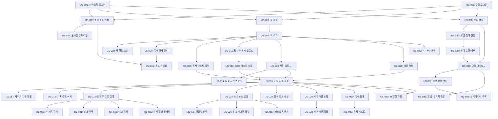

# Habitree Reading Hub - 사용자 스토리 명세서

**버전:** 1.0  
**작성일:** 2025년 12월  
**최종 수정일:** 2025년 12월  
**제품명:** Habitree Reading Hub  
**관련 문서:** [Habitree-Reading-Hub-PRD.md](./Habitree-Reading-Hub-PRD.md)

---

## 목차
1. [페르소나 정의](#페르소나-정의)
2. [우선순위 정의](#우선순위-정의)
3. [MVP 기능 사용자 스토리](#mvp-기능-사용자-스토리)
4. [Post-MVP 기능 사용자 스토리](#post-mvp-기능-사용자-스토리)
5. [스토리 의존성 다이어그램](#스토리-의존성-다이어그램)

---

## 페르소나 정의

### P1: 메인 페르소나 - 개인 독자
- **이름**: 김독서 (29세, 직장인)
- **특징**: 월 2-3권 꾸준히 독서, 인상 깊은 구절을 메모하는 습관
- **니즈**: 흩어진 독서 기록을 한 곳에서 관리하고 언제든 다시 찾고 싶음
- **목표**: 독서 습관 유지 및 성장 과정 추적

### P2: 서브 페르소나 1 - 독서모임 운영자
- **이름**: 박리더 (34세, 프리랜서)
- **특징**: 오프라인 독서모임 운영, 월 1회 정기 모임
- **니즈**: 모임 구성원들의 독서 진행 상황을 쉽게 확인하고 공유하고 싶음
- **목표**: 독서모임 활성화 및 구성원 참여 독려

### P3: 서브 페르소나 2 - 북튜버/크리에이터
- **이름**: 최콘텐츠 (26세, 1인 크리에이터)
- **특징**: 독서 관련 콘텐츠 제작, 인스타그램/유튜브 운영
- **니즈**: 독서 기록을 쉽게 콘텐츠화하여 SNS에 공유하고 싶음
- **목표**: 양질의 콘텐츠 제작 및 팔로워 확대

---

## 우선순위 정의

| 우선순위 | 설명 | 의미 |
|---------|------|------|
| **P0** | Must Have | MVP 출시를 위한 필수 기능, 없으면 제품 가치 제공 불가 |
| **P1** | Should Have | MVP에 포함되면 좋으나 없어도 출시 가능한 기능 |
| **P2** | Nice to Have | Post-MVP 기능, 향후 개선 및 확장 단계에서 구현 |

---

## MVP 기능 사용자 스토리

### 스토리 요약표

| ID | 제목 | 페르소나 | 우선순위 | 상태 |
|----|------|----------|----------|------|
| US-001 | 카카오톡 소셜 로그인 | P1, P2, P3 | P0 | 대기 |
| US-002 | 구글 소셜 로그인 | P1, P2, P3 | P0 | 대기 |
| US-003 | 독서 목표 설정 | P1 | P0 | 대기 |
| US-004 | 온보딩 튜토리얼 | P1, P2, P3 | P0 | 대기 |
| US-005 | 프로필 관리 | P1, P2, P3 | P1 | 대기 |
| US-006 | 책 검색 (네이버 API) | P1, P2, P3 | P0 | 대기 |
| US-007 | 책 추가 | P1, P2, P3 | P0 | 대기 |
| US-008 | 책 정보 조회 | P1, P2, P3 | P0 | 대기 |
| US-009 | 독서 상태 관리 | P1 | P0 | 대기 |
| US-010 | 필사 텍스트 입력 | P1, P2 | P0 | 대기 |
| US-011 | 필사 이미지 업로드 | P1, P2 | P0 | 대기 |
| US-012 | OCR 텍스트 추출 | P1, P2 | P0 | 대기 |
| US-013 | 책 페이지 사진 업로드 | P1 | P0 | 대기 |
| US-014 | 다중 사진 일괄 업로드 | P1 | P1 | 대기 |
| US-015 | 메모 작성 | P1, P2, P3 | P0 | 대기 |
| US-016 | 기록 자동 정리 | P1, P2 | P0 | 대기 |
| US-017 | 페이지 순서 자동 정렬 | P1 | P1 | 대기 |
| US-018 | 기록 수정 및 삭제 | P1, P2, P3 | P0 | 대기 |
| US-019 | 전체 텍스트 검색 | P1, P2, P3 | P0 | 대기 |
| US-020 | 책 제목으로 검색 | P1, P2, P3 | P0 | 대기 |
| US-021 | 날짜로 검색 | P1, P2 | P1 | 대기 |
| US-022 | 태그로 검색 | P1, P2 | P1 | 대기 |
| US-023 | 검색 결과 필터링 | P1 | P1 | 대기 |
| US-024 | 카드뉴스 생성 | P1, P2, P3 | P0 | 대기 |
| US-025 | 카드뉴스 템플릿 선택 | P2, P3 | P1 | 대기 |
| US-026 | 인스타그램 공유 | P2, P3 | P0 | 대기 |
| US-027 | 카카오톡 공유 | P1, P2 | P0 | 대기 |
| US-028 | 공유 링크 생성 | P1, P2, P3 | P1 | 대기 |
| US-029 | 독서 타임라인 조회 | P1 | P0 | 대기 |
| US-030 | 독서 통계 확인 | P1 | P0 | 대기 |
| US-031 | 목표 진행률 추적 | P1 | P0 | 대기 |
| US-032 | 타임라인 정렬 옵션 | P1 | P1 | 대기 |
| US-033 | 독서모임 생성 | P2 | P0 | 대기 |
| US-034 | 독서모임 참여 신청 | P1, P2 | P0 | 대기 |
| US-035 | 모임 참여 승인/거부 | P2 | P0 | 대기 |
| US-036 | 모임 대시보드 | P2 | P0 | 대기 |
| US-037 | 구성원 진행 상황 확인 | P2 | P0 | 대기 |
| US-038 | 모임 내 기록 공유 | P1, P2 | P0 | 대기 |

---

## 1. 사용자 인증 및 온보딩

### US-001: 카카오톡 소셜 로그인

**사용자 스토리**
> As a 신규 사용자, I want 카카오톡 계정으로 간편하게 로그인하고 싶다, so that 별도의 회원가입 절차 없이 빠르게 서비스를 시작할 수 있다.

**우선순위:** P0  
**페르소나:** P1, P2, P3

**수용 기준**
- [ ] Given 사용자가 로그인 페이지에 접속했을 때
- [ ] When "카카오톡으로 시작하기" 버튼을 클릭하면
- [ ] Then 카카오톡 OAuth 인증 화면으로 이동한다
- [ ] And 사용자가 인증을 완료하면 자동으로 회원가입 및 로그인된다
- [ ] And 사용자 정보(이름, 프로필 이미지)가 자동으로 저장된다

**기술적 고려사항**
- Supabase Authentication의 카카오톡 OAuth Provider 활용
- 카카오 개발자 센터에서 앱 등록 및 REST API 키 발급 필요
- 리다이렉트 URI 설정: `{domain}/auth/callback`
- Next.js API Routes를 통한 인증 처리

**의존성**
- 없음 (독립적 스토리)

---

### US-002: 구글 소셜 로그인

**사용자 스토리**
> As a 신규 사용자, I want 구글 계정으로 간편하게 로그인하고 싶다, so that 이미 사용 중인 구글 계정으로 빠르게 서비스를 시작할 수 있다.

**우선순위:** P0  
**페르소나:** P1, P2, P3

**수용 기준**
- [ ] Given 사용자가 로그인 페이지에 접속했을 때
- [ ] When "구글로 시작하기" 버튼을 클릭하면
- [ ] Then 구글 OAuth 인증 화면으로 이동한다
- [ ] And 사용자가 인증을 완료하면 자동으로 회원가입 및 로그인된다
- [ ] And 사용자 정보(이름, 이메일, 프로필 이미지)가 자동으로 저장된다

**기술적 고려사항**
- Supabase Authentication의 구글 OAuth Provider 활용
- Google Cloud Console에서 OAuth 2.0 클라이언트 ID 발급 필요
- 승인된 리다이렉트 URI 설정
- Next.js의 환경 변수로 클라이언트 ID 관리

**의존성**
- 없음 (독립적 스토리)

---

### US-003: 독서 목표 설정

**사용자 스토리**
> As a 신규 사용자, I want 올해 읽을 책의 수를 목표로 설정하고 싶다, so that 독서 습관을 지속하고 진행 상황을 추적할 수 있다.

**우선순위:** P0  
**페르소나:** P1

**수용 기준**
- [ ] Given 사용자가 처음 로그인했을 때
- [ ] When 온보딩 화면에서 "올해 읽을 책 수" 입력 필드를 보여준다
- [ ] Then 사용자는 1~100 사이의 숫자를 입력할 수 있다
- [ ] And "시작하기" 버튼을 클릭하면 목표가 저장된다
- [ ] And 나중에 프로필 설정에서 목표를 수정할 수 있다

**기술적 고려사항**
- Supabase Database의 Users 테이블에 `reading_goal` 컬럼 추가
- 입력 값 유효성 검사 (1-100 범위)
- Next.js의 상태 관리 (useState)
- Supabase Client를 통한 데이터 저장

**의존성**
- US-001 또는 US-002 (로그인 완료 후 진행)

---

### US-004: 온보딩 튜토리얼

**사용자 스토리**
> As a 신규 사용자, I want 간단한 튜토리얼을 통해 서비스 사용법을 배우고 싶다, so that 주요 기능을 빠르게 이해하고 활용할 수 있다.

**우선순위:** P0  
**페르소나:** P1, P2, P3

**수용 기준**
- [ ] Given 사용자가 목표 설정을 완료했을 때
- [ ] When 온보딩 튜토리얼이 시작된다
- [ ] Then 3-4개의 주요 기능 소개 화면이 표시된다 (책 추가, 기록 작성, 검색, 공유)
- [ ] And 각 화면은 30초 이내에 이해할 수 있어야 한다
- [ ] And "건너뛰기" 버튼으로 튜토리얼을 종료할 수 있다
- [ ] And 튜토리얼 완료 후 메인 화면으로 이동한다

**기술적 고려사항**
- Next.js의 동적 라우팅 활용 (`/onboarding/[step]`)
- 로컬 스토리지에 튜토리얼 완료 여부 저장
- Swiper 또는 Carousel 라이브러리 활용
- 애니메이션 효과로 사용자 경험 향상

**의존성**
- US-003 (목표 설정 완료 후 진행)

---

### US-005: 프로필 관리

**사용자 스토리**
> As a 사용자, I want 내 프로필 정보를 수정하고 싶다, so that 최신 정보를 유지하고 개인화된 경험을 할 수 있다.

**우선순위:** P1  
**페르소나:** P1, P2, P3

**수용 기준**
- [ ] Given 사용자가 프로필 설정 페이지에 접속했을 때
- [ ] When 이름, 프로필 이미지, 독서 목표를 수정할 수 있다
- [ ] Then "저장" 버튼을 클릭하면 변경 사항이 저장된다
- [ ] And 변경 사항이 즉시 반영된다
- [ ] And 저장 성공 시 알림 메시지가 표시된다

**기술적 고려사항**
- Supabase Storage에 프로필 이미지 업로드
- Supabase Database의 Users 테이블 업데이트
- 이미지 파일 크기 제한 (최대 2MB)
- 이미지 형식 제한 (jpg, png, webp)

**의존성**
- US-001 또는 US-002 (로그인 필요)

---

## 2. 책 관리

### US-006: 책 검색 (네이버 API)

**사용자 스토리**
> As a 사용자, I want 책 제목이나 저자로 책을 검색하고 싶다, so that 읽고 있는 책을 빠르게 찾아 추가할 수 있다.

**우선순위:** P0  
**페르소나:** P1, P2, P3

**수용 기준**
- [ ] Given 사용자가 "책 추가" 버튼을 클릭했을 때
- [ ] When 검색 입력 필드에 책 제목이나 저자를 입력하면
- [ ] Then 입력 중에 실시간으로 검색 결과가 표시된다 (디바운싱 적용)
- [ ] And 검색 결과는 책 표지, 제목, 저자, 출판사를 포함한다
- [ ] And 검색 결과가 없으면 "검색 결과가 없습니다" 메시지를 표시한다

**기술적 고려사항**
- 네이버 검색 API (책 검색) 연동
- Next.js API Routes에서 API 호출 (`/api/books/search`)
- 환경 변수로 네이버 API 키 관리
- 디바운싱 (300ms) 적용하여 API 호출 최소화
- 검색 결과 캐싱으로 성능 최적화

**의존성**
- US-001 또는 US-002 (로그인 필요)

---

### US-007: 책 추가

**사용자 스토리**
> As a 사용자, I want 검색한 책을 내 서재에 추가하고 싶다, so that 독서 기록을 시작할 수 있다.

**우선순위:** P0  
**페르소나:** P1, P2, P3

**수용 기준**
- [ ] Given 사용자가 책을 검색했을 때
- [ ] When 검색 결과에서 원하는 책을 선택하면
- [ ] Then 책 정보가 자동으로 입력된 추가 화면이 표시된다
- [ ] And 독서 상태(읽는 중, 완독, 중단)를 선택할 수 있다
- [ ] And "추가" 버튼을 클릭하면 내 서재에 책이 추가된다
- [ ] And 중복된 책은 추가할 수 없다

**기술적 고려사항**
- Supabase Database의 Books 테이블에 책 정보 저장
- UserBooks 테이블에 사용자-책 관계 저장
- ISBN 중복 체크 로직
- 트랜잭션 처리로 데이터 일관성 보장

**의존성**
- US-006 (책 검색 완료 후 진행)

---

### US-008: 책 정보 조회

**사용자 스토리**
> As a 사용자, I want 내 서재에 추가한 책의 상세 정보를 보고 싶다, so that 책에 대한 정보를 한눈에 확인할 수 있다.

**우선순위:** P0  
**페르소나:** P1, P2, P3

**수용 기준**
- [ ] Given 사용자가 내 서재에 접속했을 때
- [ ] When 책을 선택하면
- [ ] Then 책 상세 페이지가 표시된다
- [ ] And 책 표지, 제목, 저자, 출판사, 출판일이 표시된다
- [ ] And 내가 작성한 기록 목록이 표시된다
- [ ] And 독서 상태가 표시된다

**기술적 고려사항**
- Next.js 동적 라우팅 (`/books/[id]`)
- Supabase Database 조인 쿼리 (Books + UserBooks + Notes)
- 이미지 최적화 (Next.js Image 컴포넌트)
- 로딩 상태 처리

**의존성**
- US-007 (책 추가 완료 후 조회 가능)

---

### US-009: 독서 상태 관리

**사용자 스토리**
> As a 사용자, I want 책의 독서 상태를 변경하고 싶다, so that 현재 읽고 있는 책과 완독한 책을 구분하여 관리할 수 있다.

**우선순위:** P0  
**페르소나:** P1

**수용 기준**
- [ ] Given 사용자가 책 상세 페이지에 접속했을 때
- [ ] When 독서 상태 변경 버튼을 클릭하면
- [ ] Then "읽는 중", "완독", "중단" 중 선택할 수 있다
- [ ] And 상태 변경 시 즉시 반영된다
- [ ] And "완독"으로 변경 시 완독 날짜가 자동 기록된다

**기술적 고려사항**
- Supabase Database의 UserBooks 테이블 업데이트
- `status` 컬럼: Enum 타입 (reading, completed, paused)
- `completed_at` 컬럼: 완독 날짜 자동 기록
- 낙관적 업데이트(Optimistic Update)로 빠른 UI 반응

**의존성**
- US-007 (책 추가 완료 후 상태 변경 가능)

---

## 3. 기록 기능

### US-010: 필사 텍스트 입력

**사용자 스토리**
> As a 사용자, I want 인상 깊은 문장을 직접 타이핑하여 기록하고 싶다, so that 나중에 다시 찾아볼 수 있다.

**우선순위:** P0  
**페르소나:** P1, P2

**수용 기준**
- [ ] Given 사용자가 책 상세 페이지에서 "기록 추가" 버튼을 클릭했을 때
- [ ] When "필사" 탭을 선택하면
- [ ] Then 텍스트 입력 필드가 표시된다
- [ ] And 페이지 번호를 입력할 수 있다
- [ ] And "저장" 버튼을 클릭하면 필사가 저장된다
- [ ] And 저장 후 책 상세 페이지로 돌아간다

**기술적 고려사항**
- Supabase Database의 Notes 테이블에 저장
- `type` 컬럼: 'quote'로 설정
- `content` 컬럼: 사용자 입력 텍스트
- `page_number` 컬럼: 페이지 번호
- 텍스트 길이 제한 (최대 5,000자)

**의존성**
- US-007 (책 추가 완료 후 기록 가능)

---

### US-011: 필사 이미지 업로드

**사용자 스토리**
> As a 사용자, I want 손글씨로 작성한 필사 이미지를 업로드하고 싶다, so that 내 손글씨 기록을 보관하고 텍스트로 변환할 수 있다.

**우선순위:** P0  
**페르소나:** P1, P2

**수용 기준**
- [ ] Given 사용자가 "기록 추가" 화면에서 "필사" 탭을 선택했을 때
- [ ] When "이미지 업로드" 버튼을 클릭하면
- [ ] Then 파일 선택 창이 열린다
- [ ] And jpg, png, heic 형식의 이미지를 선택할 수 있다
- [ ] And 이미지 업로드 후 미리보기가 표시된다
- [ ] And "저장" 버튼을 클릭하면 이미지가 저장되고 OCR 처리가 시작된다

**기술적 고려사항**
- Supabase Storage에 이미지 저장 (`/transcriptions/{user_id}/{note_id}`)
- 이미지 파일 크기 제한 (최대 5MB)
- 5MB 초과 시 자동 압축
- Next.js의 파일 업로드 처리
- 이미지 URL을 Notes 테이블의 `image_url` 컬럼에 저장

**의존성**
- US-007 (책 추가 완료 후 기록 가능)

---

### US-012: OCR 텍스트 추출

**사용자 스토리**
> As a 사용자, I want 업로드한 필사 이미지에서 텍스트가 자동으로 추출되길 원한다, so that 수동으로 타이핑하지 않아도 텍스트 검색이 가능하다.

**우선순위:** P0  
**페르소나:** P1, P2

**수용 기준**
- [ ] Given 사용자가 필사 이미지를 업로드했을 때
- [ ] When 이미지 저장이 완료되면
- [ ] Then 즉시 응답을 받고, 백그라운드에서 OCR 처리가 시작된다
- [ ] And OCR 결과가 Notes 테이블의 `content` 컬럼에 저장된다
- [ ] And OCR 처리 중에는 "처리 중" 상태 표시가 나타난다
- [ ] And OCR 완료 시 자동으로 업데이트되거나 알림을 통해 확인할 수 있다
- [ ] And OCR 완료 후 추출된 텍스트를 확인하고 수정할 수 있다

**기술적 고려사항**
- Gemini API의 Vision 기능 활용
- Next.js API Routes에서 비동기 처리 (`/api/ocr`)
- **비동기 Queue 방식**: 이미지 업로드 후 즉시 응답, 백그라운드에서 OCR 처리
- OCR 처리 시간: 평균 3-5초 (사용자는 대기하지 않음)
- 처리 완료 시 실시간 알림 또는 페이지 새로고침으로 결과 표시
- 실패 시 재시도 로직 (최대 3회)
- OCR 정확도 향상을 위한 이미지 전처리
- Queue 시스템: Vercel Queue 또는 Supabase Edge Functions 활용

**의존성**
- US-011 (이미지 업로드 완료 후 OCR 처리)

---

### US-013: 책 페이지 사진 업로드

**사용자 스토리**
> As a 사용자, I want 책 페이지를 사진으로 찍어 업로드하고 싶다, so that 나중에 다시 볼 수 있도록 보관할 수 있다.

**우선순위:** P0  
**페르소나:** P1

**수용 기준**
- [ ] Given 사용자가 "기록 추가" 화면에서 "사진" 탭을 선택했을 때
- [ ] When "사진 업로드" 버튼을 클릭하면
- [ ] Then 파일 선택 창이 열린다
- [ ] And jpg, png, heic 형식의 이미지를 선택할 수 있다
- [ ] And 페이지 번호를 입력할 수 있다
- [ ] And "저장" 버튼을 클릭하면 사진이 저장된다

**기술적 고려사항**
- Supabase Storage에 이미지 저장 (`/photos/{user_id}/{note_id}`)
- Notes 테이블에 `type='photo'`로 저장
- 이미지 파일 크기 제한 및 자동 압축
- 이미지 최적화 (WebP 변환)

**의존성**
- US-007 (책 추가 완료 후 기록 가능)

---

### US-014: 다중 사진 일괄 업로드

**사용자 스토리**
> As a 사용자, I want 여러 장의 책 페이지 사진을 한 번에 업로드하고 싶다, so that 효율적으로 여러 페이지를 기록할 수 있다.

**우선순위:** P1  
**페르소나:** P1

**수용 기준**
- [ ] Given 사용자가 "사진" 탭에서 "사진 업로드" 버튼을 클릭했을 때
- [ ] When 여러 개의 이미지 파일을 선택하면
- [ ] Then 선택한 모든 이미지의 미리보기가 표시된다
- [ ] And 각 이미지마다 페이지 번호를 입력할 수 있다
- [ ] And "저장" 버튼을 클릭하면 모든 사진이 일괄 저장된다
- [ ] And 업로드 진행률이 표시된다

**기술적 고려사항**
- 다중 파일 업로드 처리
- Promise.all()을 사용한 병렬 업로드
- 업로드 진행 상태 표시 (ProgressBar)
- 일부 실패 시 성공한 파일만 저장하고 실패 목록 표시

**의존성**
- US-013 (단일 사진 업로드 기능 구현 후)

---

### US-015: 메모 작성

**사용자 스토리**
> As a 사용자, I want 책에 대한 생각이나 감상을 메모로 작성하고 싶다, so that 내 생각을 기록하고 나중에 회고할 수 있다.

**우선순위:** P0  
**페르소나:** P1, P2, P3

**수용 기준**
- [ ] Given 사용자가 "기록 추가" 화면에서 "메모" 탭을 선택했을 때
- [ ] When 메모 입력 필드에 텍스트를 입력하면
- [ ] Then 실시간으로 글자 수가 표시된다
- [ ] And 페이지 번호를 선택적으로 입력할 수 있다
- [ ] And "저장" 버튼을 클릭하면 메모가 저장된다

**기술적 고려사항**
- Supabase Database의 Notes 테이블에 저장
- `type` 컬럼: 'memo'로 설정
- 텍스트 길이 제한 (최대 10,000자)
- 마크다운 형식 지원 (향후 확장)

**의존성**
- US-007 (책 추가 완료 후 기록 가능)

---

### US-016: 기록 자동 정리

**사용자 스토리**
> As a 사용자, I want 내가 작성한 모든 기록이 해당 책 아래에 자동으로 정리되길 원한다, so that 기록을 일일이 분류하지 않아도 체계적으로 관리된다.

**우선순위:** P0  
**페르소나:** P1, P2

**수용 기준**
- [ ] Given 사용자가 기록을 저장할 때
- [ ] When 기록이 생성되면
- [ ] Then 자동으로 해당 책과 연결된다 (book_id)
- [ ] And 책 상세 페이지에서 모든 기록이 한눈에 표시된다
- [ ] And 기록 유형별로 구분하여 볼 수 있다 (필사/사진/메모)

**기술적 고려사항**
- Notes 테이블의 `book_id` Foreign Key로 자동 연결
- Supabase의 관계형 쿼리 활용
- 기록 목록 조회 시 JOIN 쿼리
- 캐싱으로 조회 성능 최적화

**의존성**
- US-010, US-011, US-013, US-015 (기록 생성 기능들)

---

### US-017: 페이지 순서 자동 정렬

**사용자 스토리**
> As a 사용자, I want 내 기록이 페이지 번호 순서대로 자동 정렬되길 원한다, so that 책을 읽는 순서대로 기록을 확인할 수 있다.

**우선순위:** P1  
**페르소나:** P1

**수용 기준**
- [ ] Given 사용자가 책 상세 페이지에 접속했을 때
- [ ] When 기록 목록이 표시되면
- [ ] Then 페이지 번호가 있는 기록은 오름차순으로 정렬된다
- [ ] And 페이지 번호가 없는 기록은 생성 날짜순으로 정렬된다
- [ ] And 사용자가 정렬 방식을 변경할 수 있다 (페이지순/날짜순)

**기술적 고려사항**
- Supabase 쿼리에 ORDER BY 절 추가
- 정렬 조건: `page_number ASC NULLS LAST, created_at DESC`
- 프론트엔드에서 정렬 옵션 선택 UI 제공

**의존성**
- US-016 (기록 자동 정리 기능 구현 후)

---

### US-018: 기록 수정 및 삭제

**사용자 스토리**
> As a 사용자, I want 작성한 기록을 수정하거나 삭제하고 싶다, so that 잘못 입력한 내용을 바로잡거나 불필요한 기록을 제거할 수 있다.

**우선순위:** P0  
**페르소나:** P1, P2, P3

**수용 기준**
- [ ] Given 사용자가 기록을 선택했을 때
- [ ] When "수정" 버튼을 클릭하면
- [ ] Then 기록 편집 화면이 표시되고 내용을 수정할 수 있다
- [ ] And "저장" 버튼을 클릭하면 변경 사항이 저장된다
- [ ] When "삭제" 버튼을 클릭하면
- [ ] Then 삭제 확인 다이얼로그가 표시된다
- [ ] And "확인" 버튼을 클릭하면 기록이 삭제된다

**기술적 고려사항**
- Supabase의 UPDATE, DELETE 쿼리
- Row Level Security (RLS)로 본인 기록만 수정/삭제 가능
- 이미지 삭제 시 Supabase Storage에서도 파일 삭제
- 낙관적 업데이트로 빠른 UI 반응

**의존성**
- US-016 (기록 생성 후 수정/삭제 가능)

---

## 4. 검색 기능

### US-019: 전체 텍스트 검색

**사용자 스토리**
> As a 사용자, I want 저장한 모든 문장을 검색하고 싶다, so that 몇 달 전에 읽은 책의 특정 문장도 빠르게 찾을 수 있다.

**우선순위:** P0  
**페르소나:** P1, P2, P3

**수용 기준**
- [ ] Given 사용자가 검색 페이지에 접속했을 때
- [ ] When 검색어를 입력하면
- [ ] Then 검색어가 포함된 모든 기록이 표시된다
- [ ] And 검색 결과는 1초 이내에 표시되어야 한다
- [ ] And 검색어가 하이라이트되어 표시된다
- [ ] And 검색 결과에는 책 제목, 기록 내용, 페이지 번호가 포함된다

**기술적 고려사항**
- Supabase의 Full-text Search 기능 활용
- `content` 컬럼에 tsvector 인덱스 생성
- 검색 쿼리: `to_tsquery('simple', search_term)`
- 한글 형태소 분석 지원
- 페이지네이션 (한 페이지당 20개)

**의존성**
- US-016 (기록이 있어야 검색 가능)

---

### US-020: 책 제목으로 검색

**사용자 스토리**
> As a 사용자, I want 특정 책의 기록만 검색하고 싶다, so that 해당 책에서 작성한 기록만 빠르게 찾을 수 있다.

**우선순위:** P0  
**페르소나:** P1, P2, P3

**수용 기준**
- [ ] Given 사용자가 검색 페이지에 접속했을 때
- [ ] When "책 제목" 필터를 선택하고 검색하면
- [ ] Then 해당 책의 기록만 검색 결과에 표시된다
- [ ] And 자동완성으로 책 제목을 추천한다

**기술적 고려사항**
- Books 테이블과 Notes 테이블 JOIN 쿼리
- 책 제목 자동완성: `LIKE` 또는 `ILIKE` 쿼리
- 검색 결과 캐싱

**의존성**
- US-019 (전체 텍스트 검색 기능 구현 후)

---

### US-021: 날짜로 검색

**사용자 스토리**
> As a 사용자, I want 특정 기간에 작성한 기록을 검색하고 싶다, so that 시간대별로 내 독서 기록을 확인할 수 있다.

**우선순위:** P1  
**페르소나:** P1, P2

**수용 기준**
- [ ] Given 사용자가 검색 페이지에 접속했을 때
- [ ] When "날짜" 필터를 선택하고 시작일과 종료일을 입력하면
- [ ] Then 해당 기간에 작성된 기록만 표시된다
- [ ] And "최근 1주일", "최근 1개월" 등 빠른 선택 옵션을 제공한다

**기술적 고려사항**
- Notes 테이블의 `created_at` 컬럼 필터링
- SQL 쿼리: `WHERE created_at BETWEEN start_date AND end_date`
- Date Picker 컴포넌트 활용

**의존성**
- US-019 (전체 텍스트 검색 기능 구현 후)

---

### US-022: 태그로 검색

**사용자 스토리**
> As a 사용자, I want 태그로 기록을 검색하고 싶다, so that 비슷한 주제의 기록을 한 번에 찾을 수 있다.

**우선순위:** P1  
**페르소나:** P1, P2

**수용 기준**
- [ ] Given 사용자가 기록을 작성할 때 태그를 추가할 수 있다
- [ ] When 검색 페이지에서 "태그" 필터를 선택하면
- [ ] Then 내가 사용한 모든 태그 목록이 표시된다
- [ ] And 태그를 선택하면 해당 태그가 달린 기록만 표시된다

**기술적 고려사항**
- Notes 테이블에 `tags` 컬럼 추가 (Array 타입 또는 별도 Tags 테이블)
- 태그 자동완성 기능
- 다중 태그 필터링 지원

**의존성**
- US-019 (전체 텍스트 검색 기능 구현 후)

---

### US-023: 검색 결과 필터링

**사용자 스토리**
> As a 사용자, I want 검색 결과를 기록 유형별로 필터링하고 싶다, so that 원하는 형태의 기록만 볼 수 있다.

**우선순위:** P1  
**페르소나:** P1

**수용 기준**
- [ ] Given 사용자가 검색 결과를 확인할 때
- [ ] When 필터 옵션을 선택하면
- [ ] Then "필사", "사진", "메모" 중 선택한 유형의 기록만 표시된다
- [ ] And 여러 유형을 동시에 선택할 수 있다

**기술적 고려사항**
- Notes 테이블의 `type` 컬럼 필터링
- SQL 쿼리: `WHERE type IN ('quote', 'photo', 'memo')`
- 프론트엔드에서 체크박스로 다중 선택 UI 제공

**의존성**
- US-019 (전체 텍스트 검색 기능 구현 후)

---

## 5. 공유 기능

### US-024: 카드뉴스 생성

**사용자 스토리**
> As a 사용자, I want 인상 깊은 문장을 카드뉴스 형태로 생성하고 싶다, so that 시각적으로 아름다운 콘텐츠를 만들 수 있다.

**우선순위:** P0  
**페르소나:** P1, P2, P3

**수용 기준**
- [ ] Given 사용자가 기록을 선택했을 때
- [ ] When "공유" 버튼을 클릭하면
- [ ] Then 선택한 문장이 카드뉴스 형태로 자동 생성된다
- [ ] And 카드뉴스는 책 제목, 저자, 문장을 포함한다
- [ ] And 이미지 형식으로 다운로드할 수 있다

**기술적 고려사항**
- Next.js의 서버 사이드에서 이미지 생성
- Canvas API 또는 `@vercel/og` 라이브러리 활용
- 이미지 크기: 1080x1080 (인스타그램 정사각형)
- 다양한 폰트 및 배경 템플릿 제공

**의존성**
- US-016 (기록이 있어야 공유 가능)

---

### US-025: 카드뉴스 템플릿 선택

**사용자 스토리**
> As a 사용자, I want 다양한 카드뉴스 템플릿 중에서 선택하고 싶다, so that 내 취향에 맞는 디자인으로 공유할 수 있다.

**우선순위:** P1  
**페르소나:** P2, P3

**수용 기준**
- [ ] Given 사용자가 카드뉴스 생성 화면에 있을 때
- [ ] When 템플릿 선택 버튼을 클릭하면
- [ ] Then 5개 이상의 템플릿이 미리보기와 함께 표시된다
- [ ] And 템플릿을 선택하면 실시간으로 미리보기가 업데이트된다

**기술적 고려사항**
- 템플릿 데이터를 JSON 형식으로 관리
- 각 템플릿은 배경색, 폰트, 레이아웃 정보 포함
- 템플릿 미리보기는 클라이언트 사이드에서 렌더링

**의존성**
- US-024 (카드뉴스 생성 기능 구현 후)

---

### US-026: 인스타그램 공유

**사용자 스토리**
> As a 사용자, I want 생성한 카드뉴스를 인스타그램에 바로 공유하고 싶다, so that 팔로워들과 독서 기록을 나눌 수 있다.

**우선순위:** P0  
**페르소나:** P2, P3

**수용 기준**
- [ ] Given 사용자가 카드뉴스를 생성했을 때
- [ ] When "인스타그램에 공유" 버튼을 클릭하면
- [ ] Then 이미지가 다운로드되고 인스타그램 앱/웹으로 이동한다
- [ ] And 모바일에서는 인스타그램 앱이 자동으로 열린다

**기술적 고려사항**
- Web Share API 활용 (모바일)
- 이미지 다운로드 기능 (데스크톱)
- 인스타그램 딥링크: `instagram://`
- 파일 다운로드: Blob 및 createObjectURL 활용

**의존성**
- US-024 (카드뉴스 생성 완료 후 공유 가능)

---

### US-027: 카카오톡 공유

**사용자 스토리**
> As a 사용자, I want 카드뉴스를 카카오톡으로 공유하고 싶다, so that 친구들과 독서 기록을 쉽게 나눌 수 있다.

**우선순위:** P0  
**페르소나:** P1, P2

**수용 기준**
- [ ] Given 사용자가 카드뉴스를 생성했을 때
- [ ] When "카카오톡에 공유" 버튼을 클릭하면
- [ ] Then 카카오톡 공유 창이 열린다
- [ ] And 카드뉴스 이미지와 함께 미리보기가 표시된다

**기술적 고려사항**
- 카카오 JavaScript SDK 활용
- `Kakao.Share.sendDefault()` 메서드 사용
- 카드뉴스 이미지 URL을 공유 메시지에 포함
- 공유 링크 클릭 시 해당 기록 페이지로 이동

**의존성**
- US-024 (카드뉴스 생성 완료 후 공유 가능)

---

### US-028: 공유 링크 생성

**사용자 스토리**
> As a 사용자, I want 기록을 링크로 공유하고 싶다, so that 다양한 채널에서 내 독서 기록을 공유할 수 있다.

**우선순위:** P1  
**페르소나:** P1, P2, P3

**수용 기준**
- [ ] Given 사용자가 기록을 공개로 설정했을 때
- [ ] When "링크 복사" 버튼을 클릭하면
- [ ] Then 공유 가능한 URL이 클립보드에 복사된다
- [ ] And "링크가 복사되었습니다" 알림이 표시된다
- [ ] And 해당 링크를 통해 다른 사용자가 기록을 볼 수 있다

**기술적 고려사항**
- 공유 URL 형식: `{domain}/share/notes/{note_id}`
- Notes 테이블의 `is_public` 컬럼으로 공개/비공개 관리
- Clipboard API 활용
- Open Graph 메타 태그 설정 (미리보기)

**의존성**
- US-016 (기록이 있어야 공유 가능)

---

## 6. 타임라인 기능

### US-029: 독서 타임라인 조회

**사용자 스토리**
> As a 사용자, I want 내 독서 기록을 시간순으로 보고 싶다, so that 내가 언제 무엇을 읽었는지 한눈에 확인할 수 있다.

**우선순위:** P0  
**페르소나:** P1

**수용 기준**
- [ ] Given 사용자가 타임라인 페이지에 접속했을 때
- [ ] When 타임라인이 표시되면
- [ ] Then 최신 기록부터 시간순으로 정렬되어 표시된다
- [ ] And 각 기록은 날짜, 책 제목, 기록 내용을 포함한다
- [ ] And 월별로 그룹화되어 표시된다

**기술적 고려사항**
- Notes 테이블에서 `created_at` 기준으로 정렬
- SQL 쿼리: `ORDER BY created_at DESC`
- 무한 스크롤 또는 페이지네이션 적용
- 날짜별 그룹화 로직 (프론트엔드)

**의존성**
- US-016 (기록이 있어야 타임라인 조회 가능)

---

### US-030: 독서 통계 확인

**사용자 스토리**
> As a 사용자, I want 내 독서 통계를 확인하고 싶다, so that 내가 얼마나 독서하고 있는지 파악할 수 있다.

**우선순위:** P0  
**페르소나:** P1

**수용 기준**
- [ ] Given 사용자가 통계 페이지에 접속했을 때
- [ ] When 통계 정보가 표시되면
- [ ] Then 이번 주 읽은 책 수, 작성한 기록 수가 표시된다
- [ ] And 올해 읽은 책 수가 표시된다
- [ ] And 가장 많이 기록한 책이 표시된다

**기술적 고려사항**
- Supabase의 집계 쿼리 활용
- SQL 함수: `COUNT()`, `GROUP BY`
- 차트 라이브러리: Recharts 또는 Chart.js
- 캐싱으로 조회 성능 최적화

**의존성**
- US-016 (기록이 있어야 통계 확인 가능)

---

### US-031: 목표 진행률 추적

**사용자 스토리**
> As a 사용자, I want 올해 독서 목표 대비 진행률을 확인하고 싶다, so that 목표 달성을 위한 동기 부여를 받을 수 있다.

**우선순위:** P0  
**페르소나:** P1

**수용 기준**
- [ ] Given 사용자가 독서 목표를 설정했을 때
- [ ] When 대시보드에 접속하면
- [ ] Then 목표 대비 진행률이 퍼센트로 표시된다
- [ ] And 프로그레스 바로 시각화된다
- [ ] And 목표 달성까지 남은 책 수가 표시된다

**기술적 고려사항**
- Users 테이블의 `reading_goal` 값 조회
- UserBooks 테이블에서 `status='completed'` 개수 집계
- 진행률 계산: `(완독한 책 수 / 목표) * 100`
- 프로그레스 바 컴포넌트 구현

**의존성**
- US-003 (독서 목표 설정)
- US-009 (독서 상태 관리)

---

### US-032: 타임라인 정렬 옵션

**사용자 스토리**
> As a 사용자, I want 타임라인을 다양한 방식으로 정렬하고 싶다, so that 원하는 방식으로 독서 기록을 확인할 수 있다.

**우선순위:** P1  
**페르소나:** P1

**수용 기준**
- [ ] Given 사용자가 타임라인 페이지에 있을 때
- [ ] When 정렬 옵션을 선택하면
- [ ] Then "최신순", "오래된순", "책별" 중 선택할 수 있다
- [ ] And 선택한 옵션에 따라 타임라인이 재정렬된다

**기술적 고려사항**
- 클라이언트 사이드 정렬 또는 서버 사이드 쿼리
- 정렬 옵션을 URL 쿼리 파라미터로 저장
- 사용자 선택을 로컬 스토리지에 저장

**의존성**
- US-029 (타임라인 조회 기능 구현 후)

---

## 7. 독서모임 기능

### US-033: 독서모임 생성

**사용자 스토리**
> As a 독서모임 운영자, I want 독서모임을 생성하고 싶다, so that 구성원들과 함께 책을 읽고 기록을 공유할 수 있다.

**우선순위:** P0  
**페르소나:** P2

**수용 기준**
- [ ] Given 사용자가 "모임 만들기" 버튼을 클릭했을 때
- [ ] When 모임 이름, 설명, 공개/비공개를 입력하면
- [ ] Then "생성" 버튼을 클릭하여 모임이 생성된다
- [ ] And 생성자는 자동으로 리더가 된다
- [ ] And 모임 대시보드로 이동한다

**기술적 고려사항**
- Supabase Database의 Groups 테이블에 저장
- GroupMembers 테이블에 리더 정보 자동 추가
- `leader_id`는 생성자의 user_id
- RLS로 리더만 모임 설정 수정 가능

**의존성**
- US-001 또는 US-002 (로그인 필요)

---

### US-034: 독서모임 참여 신청

**사용자 스토리**
> As a 사용자, I want 독서모임에 참여 신청하고 싶다, so that 다른 사람들과 함께 책을 읽을 수 있다.

**우선순위:** P0  
**페르소나:** P1, P2

**수용 기준**
- [ ] Given 사용자가 모임 목록을 확인할 때
- [ ] When 원하는 모임을 선택하고 "참여 신청" 버튼을 클릭하면
- [ ] Then 참여 신청이 제출된다
- [ ] And "승인 대기 중" 상태로 표시된다
- [ ] And 모임 리더에게 알림이 전송된다 (향후 구현)

**기술적 고려사항**
- GroupMembers 테이블에 `status='pending'`으로 저장
- 공개 모임은 자동 승인, 비공개 모임은 리더 승인 필요
- 중복 신청 방지 로직

**의존성**
- US-033 (모임이 생성되어 있어야 참여 가능)

---

### US-035: 모임 참여 승인/거부

**사용자 스토리**
> As a 독서모임 리더, I want 참여 신청을 승인하거나 거부하고 싶다, so that 모임 구성원을 관리할 수 있다.

**우선순위:** P0  
**페르소나:** P2

**수용 기준**
- [ ] Given 리더가 모임 관리 페이지에 접속했을 때
- [ ] When 참여 신청 목록을 확인하면
- [ ] Then 각 신청에 대해 "승인" 또는 "거부" 버튼이 표시된다
- [ ] And "승인" 클릭 시 해당 사용자가 멤버로 추가된다
- [ ] And "거부" 클릭 시 신청이 삭제된다

**기술적 고려사항**
- GroupMembers 테이블의 `status`를 'pending'에서 'approved'로 변경
- RLS로 리더만 승인/거부 가능
- 승인/거부 시 신청자에게 알림 전송 (향후 구현)

**의존성**
- US-034 (참여 신청이 있어야 승인/거부 가능)

---

### US-036: 모임 대시보드

**사용자 스토리**
> As a 독서모임 멤버, I want 모임 대시보드를 확인하고 싶다, so that 모임의 전반적인 현황을 파악할 수 있다.

**우선순위:** P0  
**페르소나:** P2

**수용 기준**
- [ ] Given 사용자가 모임 페이지에 접속했을 때
- [ ] When 대시보드가 표시되면
- [ ] Then 모임 정보, 구성원 목록, 현재 읽는 책이 표시된다
- [ ] And 구성원들의 최근 활동이 표시된다
- [ ] And 공유된 기록 목록이 표시된다

**기술적 고려사항**
- Groups, GroupMembers, GroupBooks 테이블 JOIN 쿼리
- 최근 활동: Notes 테이블에서 모임 멤버의 최근 기록 조회
- 실시간 업데이트 (Supabase Realtime 활용, 향후 구현)

**의존성**
- US-033 (모임 생성)
- US-035 (멤버 승인)

---

### US-037: 구성원 진행 상황 확인

**사용자 스토리**
> As a 독서모임 리더, I want 구성원들의 독서 진행 상황을 확인하고 싶다, so that 모임 활동을 효과적으로 관리할 수 있다.

**우선순위:** P0  
**페르소나:** P2

**수용 기준**
- [ ] Given 리더가 모임 대시보드에 접속했을 때
- [ ] When "진행 상황" 탭을 선택하면
- [ ] Then 각 구성원의 독서 진행률이 표시된다
- [ ] And 구성원별 작성한 기록 수가 표시된다
- [ ] And 최근 활동 일자가 표시된다

**기술적 고려사항**
- GroupMembers와 UserBooks, Notes 테이블 JOIN 쿼리
- 진행률 계산: 완독 페이지 / 전체 페이지 (향후 구현)
- 구성원별 통계 집계 쿼리

**의존성**
- US-036 (모임 대시보드 구현)

---

### US-038: 모임 내 기록 공유

**사용자 스토리**
> As a 독서모임 멤버, I want 내 기록을 모임 내에서 공유하고 싶다, so that 다른 멤버들과 생각을 나눌 수 있다.

**우선순위:** P0  
**페르소나:** P1, P2

**수용 기준**
- [ ] Given 사용자가 기록을 작성할 때
- [ ] When "모임에 공유" 옵션을 선택하면
- [ ] Then 내가 속한 모임 목록이 표시된다
- [ ] And 공유할 모임을 선택할 수 있다
- [ ] And 선택한 모임의 대시보드에 해당 기록이 표시된다

**기술적 고려사항**
- GroupNotes 테이블 추가 (group_id, note_id)
- 다중 모임 공유 지원
- Notes 테이블의 공개 범위 확장: 'private', 'group', 'public'

**의존성**
- US-016 (기록 생성)
- US-036 (모임 대시보드)

---

## Post-MVP 기능 사용자 스토리

### US-039: AI 기반 문장 추천

**사용자 스토리**
> As a 사용자, I want AI가 내 기록을 분석하여 관련 문장을 추천받고 싶다, so that 비슷한 주제의 기록을 발견하고 연결할 수 있다.

**우선순위:** P2  
**페르소나:** P1, P2

**수용 기준**
- [ ] Given 사용자가 기록을 조회할 때
- [ ] When "관련 문장 보기" 버튼을 클릭하면
- [ ] Then AI가 분석한 유사 문장 목록이 표시된다
- [ ] And 유사도 점수가 함께 표시된다

**기술적 고려사항**
- Gemini API의 텍스트 임베딩 기능 활용
- 벡터 유사도 계산 (Cosine Similarity)
- Supabase에서 pgvector 확장 사용 (향후 검토)

**의존성**
- US-016 (기록이 충분히 축적된 후)

---

### US-040: 주간/월간 독서 리포트

**사용자 스토리**
> As a 사용자, I want 주간/월간 독서 리포트를 자동으로 받고 싶다, so that 내 독서 습관을 돌아보고 개선할 수 있다.

**우선순위:** P2  
**페르소나:** P1

**수용 기준**
- [ ] Given 일주일 또는 한 달이 지났을 때
- [ ] When 리포트가 자동 생성되면
- [ ] Then 읽은 책, 작성한 기록, 가장 많이 기록한 주제가 포함된다
- [ ] And 이메일 또는 앱 내 알림으로 전송된다

**기술적 고려사항**
- Vercel의 Cron Jobs 또는 Supabase Functions 활용
- 리포트 생성: 통계 데이터 집계 및 템플릿 렌더링
- 이메일 발송: Resend 또는 SendGrid API

**의존성**
- US-030 (독서 통계)

---

### US-041: 크리에이터 구독 기능

**사용자 스토리**
> As a 크리에이터, I want 구독자와 함께 읽기 챌린지를 운영하고 싶다, so that 커뮤니티를 형성하고 활성화할 수 있다.

**우선순위:** P2  
**페르소나:** P3

**수용 기준**
- [ ] Given 크리에이터가 챌린지를 생성했을 때
- [ ] When 구독자가 챌린지에 참여하면
- [ ] Then 구독자의 진행 상황을 크리에이터가 확인할 수 있다
- [ ] And 크리에이터가 피드백을 제공할 수 있다

**기술적 고려사항**
- Challenges 테이블 추가
- 구독 관계 테이블 (Subscriptions)
- 챌린지 참여 및 진행 상황 추적 로직

**의존성**
- US-037 (진행 상황 확인 기능)

---

### US-042: 책 대여 및 판매

**사용자 스토리**
> As a 사용자, I want 다른 사용자와 책을 대여하거나 판매하고 싶다, so that 책을 더 효율적으로 활용할 수 있다.

**우선순위:** P2  
**페르소나:** P1, P2

**수용 기준**
- [ ] Given 사용자가 책을 등록했을 때
- [ ] When "대여/판매 등록" 버튼을 클릭하면
- [ ] Then 대여 또는 판매 옵션을 선택할 수 있다
- [ ] And 다른 사용자가 검색하여 신청할 수 있다

**기술적 고려사항**
- BookCirculation 테이블 추가
- 거래 상태 관리 (available, requested, rented, sold)
- 사용자 간 메시징 기능 필요 (향후 검토)

**의존성**
- US-007 (책 추가)

---

## 스토리 의존성 다이어그램

---

## 문서 이력

| 버전 | 날짜 | 작성자 | 변경 내용 |
|------|------|--------|----------|
| 1.0 | 2025-12 | - | 초기 사용자 스토리 명세서 작성 |

---

**문서 끝**

